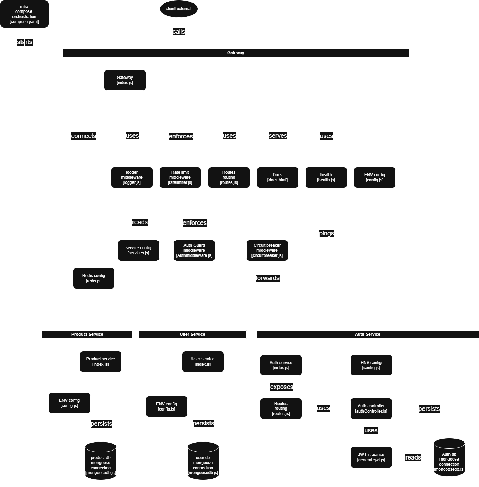

# API Gateway

A production-grade API Gateway built from scratch with Node.js and Express, sitting in front of three microservices and handling authentication, rate limiting, routing, and resilience.


---

## Architecture
 

Only the gateway is exposed publicly. Auth, User, and Product services live on internal network and are unreachable from outside — even if someone knows the port, there's nothing to connect to.

---

## Features

### Gateway
- **JWT authentication** — access token (15 min) + refresh token (7 day) rotation
- **Token revocation** — logout blacklists the refresh token in Redis; a stolen token stops working immediately, not just after expiry
- **Redis-backed rate limiting** — persists across restarts and scales across multiple instances; separate stricter limiter on `/login` and `/signup`
- **Circuit breaker** (via `opossum`) — wraps every proxied call; after repeated failures the circuit opens and the gateway fails fast instead of waiting out a 5s timeout on every request
- **Role-based access control** — `user` vs `admin`, enforced at the gateway and double-checked at the service
- **Internal secret header** — services reject any request that didn't come through the gateway, even if someone knows their port
- **Request tracing** — every request gets a `x-request-id`, logged with method, status, and duration
- **Background health monitoring** — pings all services every 15s, logs state transitions (not spammy — only logs on change)
- **CORS, structured 404 / global error handling, startup env validation** — gateway refuses to boot if a critical secret is missing

### Services
- **Auth service** — bcrypt password hashing, JWT issuance, MongoDB-backed
- **User service** — profile read/update, admin-only user listing
- **Product service** — full CRUD, admin-gated writes

---

## Tech Stack

| Layer | Technology |
|---|---|
| Runtime | Node.js, Express |
| Auth | JWT (`jsonwebtoken`), `bcrypt` |
| Cache / State | Redis Cloud |
| Resilience | `opossum` (circuit breaker) |
| Proxy | `http-proxy-middleware` |
| Database | MongoDB (Mongoose) |
| Containerization | Docker, Docker Compose |
| Docs | Custom interactive API explorer (`/docs`) |

---

## Project Structure

```
Api-gateway/
├── compose.yaml
├── gateway/
│   ├── index.js
│   ├── config/          # env validation, Redis client, service registry
│   ├── middleware/       # auth, rate limiter, logger
│   ├── routes/           # route definitions + circuit breaker wiring
│   ├── public/            # static API docs page
│   └── Dockerfile
└── services/
    ├── Auth-service/
    ├── user-service/
    └── product-service/
        └── (each with its own Dockerfile, .env, MongoDB connection)
```

---

## Getting Started

### Prerequisites
- Node.js 22+
- Docker Desktop
- A free [Redis Cloud](https://redis.io/try-free) database
- A local or [MongoDB Atlas](https://www.mongodb.com/cloud/atlas) database

### 1. Clone and configure

```bash
git clone https://github.com/Aditya18mew/Api-gateway.git
cd Api-gateway
```

Copy `.env.example` → `.env`,`.env.docker` in **each** of `gateway/`, `services/Auth-service/`, `services/user-service/`, `services/product-service/`, and fill in the values.

### 2. Run with Docker (recommended)

```bash
docker compose up --build
```

This starts all four services on an internal network. Only the gateway is reachable from your machine, at `http://localhost:3000`.

### 3. Or run locally without Docker

In four separate terminals:

```bash
cd gateway && npm install && node index.js
cd services/Auth-service && npm install && node index.js
cd services/user-service && npm install && node index.js
cd services/product-service && npm install && node index.js
```

---

## API Documentation

Once running, visit:

```
http://localhost:3000/docs      → interactive API explorer (try every endpoint live)
http://localhost:3000/health    → aggregated health + circuit breaker state
```

### Quick reference

| Method | Route | Auth | Description |
|---|---|---|---|
| POST | `/signup` | — | Register a new user |
| POST | `/login` | — | Authenticate, receive JWT cookies |
| POST | `/logout` | — | Revoke refresh token, clear cookies |
| GET | `/users/profile` | user | Get own profile |
| PUT | `/users/profile` | user | Update own profile |
| GET | `/admin/users` | admin | List all users |
| GET | `/products` | user | List products |
| POST | `admin/products/add` | admin | Create a product |
| PUT | `admin/products/:id` | admin | Update a product |
| DELETE | `admin/products/:id` | admin | Delete a product |
| GET | `/health` | — | Service + circuit breaker status |

Full request/response shapes are in `/docs`.

---

## Security Notes

- Passwords hashed with `bcrypt`, never stored or logged in plaintext
- Access tokens are short-lived (15 min); refresh tokens rotate on every use
- Cookies are `httpOnly`, `sameSite: strict`, and `secure` in production
- Services never trust client-supplied identity headers — the gateway strips and re-sets `x-user-id` / `x-role` from the verified JWT before forwarding
- Services are unreachable except through the gateway (Docker internal network + internal secret header as defense in depth)
- `.env`,`.env.docker` files are gitignored; see `.env.example` for required variables

---

## What I'd Add With More Time

- Service-level JWT verification (defense in depth, not just trusting the gateway)
- API versioning (`/v1`, `/v2`)
- Response caching for high-traffic GET routes
- Full Prometheus + Grafana stack for dashboards

---

## License

MIT
